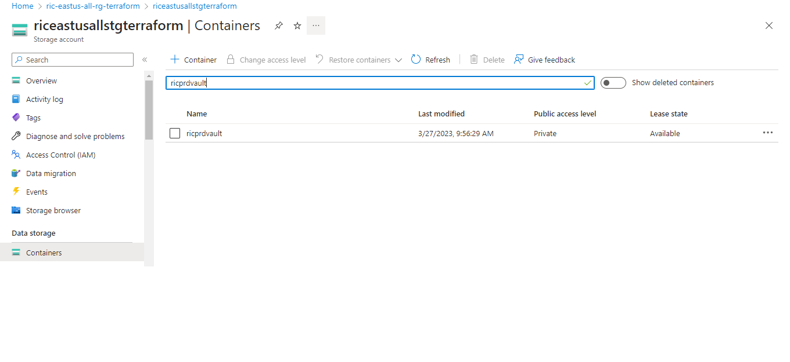
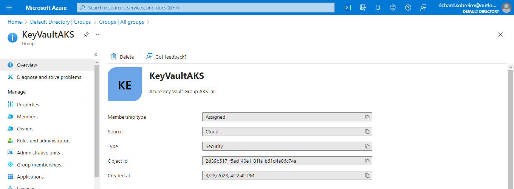
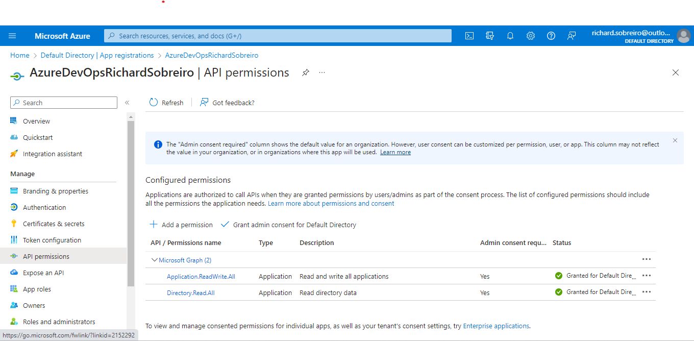
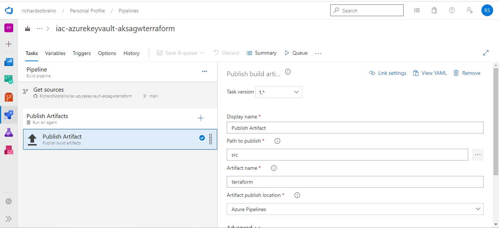
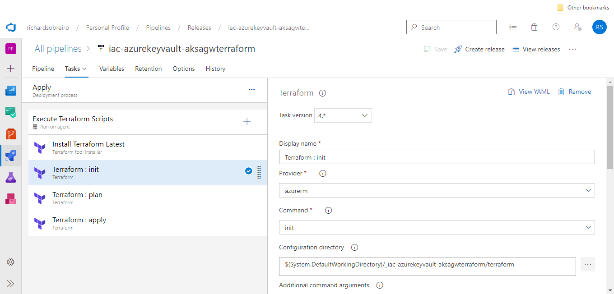
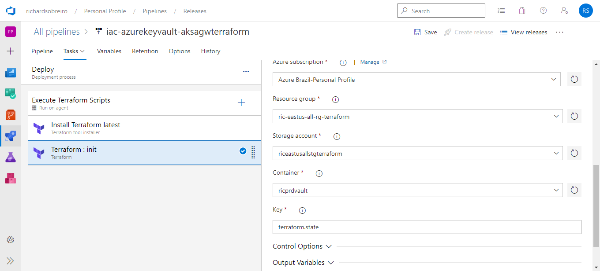
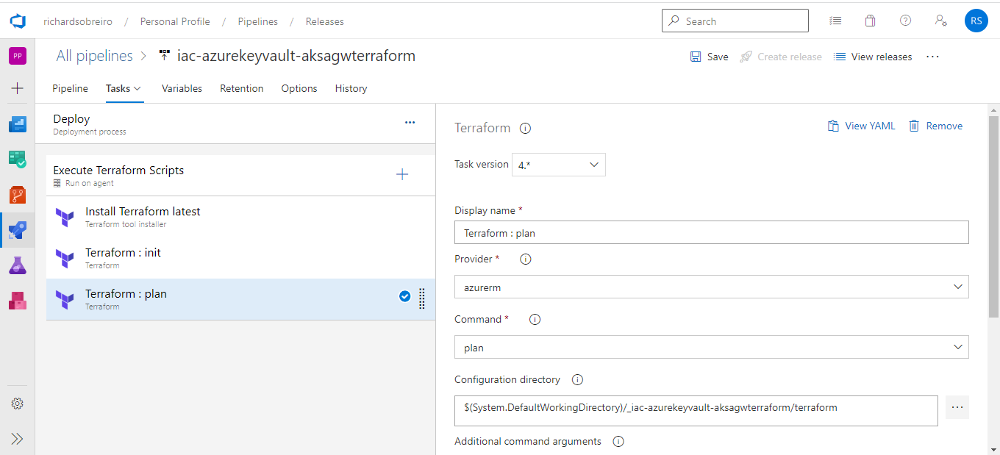
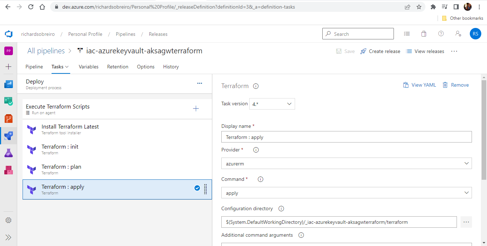

<!-- @format -->

# Azure Key Vault with Terraform

Creation of an Azure Key Vault resource with Terraform.

## Pre-Requisites

### 1 - Create manually the resource group to store terraform state

Terrafom allow us to define, preview, and deploy the creation of cloud infrastructure.
After you create your configuration files, you create an execution plan that allows you to preview your infrastructure changes before they're deployed. Once you verify the changes, you apply the execution plan to deploy the infrastructure. By default, Terraform state is stored locally, which isn't ideal for the following reasons:

- Local state doesn't work well in a team or collaborative environment.
- Terraform state can include sensitive information.
- Storing state locally increases the chance of inadvertent deletion.

To store remotely our terraform state, create a Storage Account and a cpntainer:



### 2 - Create the Azure AD Group manually

A Key Vault access policy determines whether a given security principal, namely a user, application or user group, can perform different operations on Key Vault secrets, keys, and certificates. To avoid the need to specify Key Vault permissions user by user we created one Azure AD Group named KeyVaultAKS. Access policies are applied to this group.



## Terraform Code

The terraform is quite simple and straightforward. Following, we will discuss the main files an lines of code.

### main.tf

Inside the backed azurerm provider section we specify the storage account information required to store the terraform state. Off course, this storage account is the same one create in the first section.

```
provider "azurerm" {
  features {
     key_vault {
      purge_soft_deleted_secrets_on_destroy = true
      recover_soft_deleted_secrets          = true
    }
  }
}

terraform {
  required_providers {
    azuread = {
      source  = "hashicorp/azuread"
      version = "=2.36.0"
    }
    azurerm = {
      source  = "hashicorp/azurerm"
      version = "=3.0.0"
    }
  }
  backend "azurerm" {
    resource_group_name  = "ric-eastus-all-rg-terraform"
    storage_account_name = "riceastusallstgterraform"
    container_name       = "ricprdvault"
    key                  = "terraform.tfstate"
  }
}
```

### vault.tf

The first interesting section is the access policies code.

```
access_policy {
    tenant_id = data.azurerm_client_config.current.tenant_id
    object_id = data.azuread_group.admin.id

    certificate_permissions = [
```

The access policy created by the code above will provide permissions for the Azure AD group KeyVaultAKS, while the following access policy code grants permissions for the Principal executing the terraform apply operation which creates the Key Vault Resource. It can be a little bit fuzzy but without the following code, even an administrator user would'nt be able to see the secrets and certificates created by the terraform code here.

```
access_policy {
    tenant_id = data.azurerm_client_config.current.tenant_id
    object_id    = data.azurerm_client_config.current.object_id

    certificate_permissions = [
```

As an example, we also create one secret and one certificate inside the newly created Key Vault. The certificate is a self-signed one.

```
resource "azurerm_key_vault_secret" "akssshpublickey" {
  name         = "aks-ssh-public-key"
  value        = "aks-ssh-public-key"
  key_vault_id = azurerm_key_vault.kv.id
}

resource "azurerm_key_vault_certificate" "example" {
  name         = "sslcertificate"
  key_vault_id = azurerm_key_vault.kv.id

  certificate {
    contents = filebase64("domain.pfx")
    password = ""
  }
}
```

## Azure DevOps Pipeline

We will are using the Azure DevOps Classic Editor for the Build and Release Pipelines.

### Pre-Requisites

- [Azure DevOps Service Connection to Azure Portal](https://learn.microsoft.com/en-us/azure/devops/pipelines/library/connect-to-azure?view=azure-devops)

- When authenticated with a service principal, the app registration in Azure Active Directory requires one of the following application roles: Group.Read.All or Directory.Read.All



### Build Pipeline

The build pipeline just publishes the terraform scripts. You can visit this pipeline using the [this url](https://dev.azure.com/richardsobreiro/Personal%20Profile/_build?definitionId=25).



### Release Pipeline

The first step we need to do is install the terraform on the Agent and also execute the terraform init command:



The storage account information also needs to be provided. The terraform state will be stored there:



Next, it's time to setup the plan task. The extra parameters here refer to the (Azure Subscription Service Connection)[https://learn.microsoft.com/en-us/azure/devops/pipelines/library/connect-to-azure?view=azure-devops]:



And finally, we setup the apply task:


